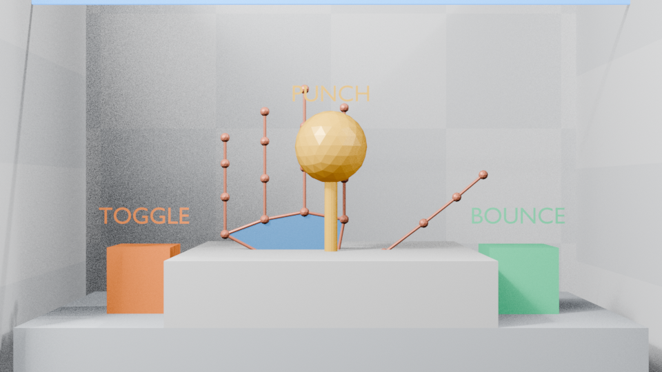

# Phone Hand Control

用手机浏览器摄像头实时驱动 Blender 中的手部模型。手机端运行 MediaPipe Hand Landmarker，PC 运行本地 HTTPS/WebSocket 桥接器，Blender 插件通过 UDP 获取“最新帧”并在 60 Hz 定时器中更新模型。

整套系统只使用 Blender、PC 和手机：

- 手机不安装 App，不需要 USB，不把摄像头画面上传云端。
- 浏览器完成手部 21 关键点推理；PC 不承担视觉推理。
- 手机与 PC 接入同一个局域网即可。
- 页面、WASM 和手部模型全部由 PC 本地托管，运行时不依赖公网。

## 架构

```text
手机浏览器
  getUserMedia(1280x720@60)
          |
  MediaPipe Hand Landmarker (GPU/CPU)
          |
  21 关键点 + 21 世界关键点
          |
  WSS 二进制帧 60 Hz
          v
PC 本地 Bridge (Python stdlib + TLS)
  token 校验 / 统计 / 丢弃畸形帧
          |
  UDP 127.0.0.1:8766 (最新帧优先)
          v
Blender 插件
  UDP 线程 -> 无锁“最新帧”槽 -> bpy timer 60 Hz
          |
  One Euro 自适应滤波 + 可选 0-30 ms 预测
          |
  演示手模型 / 自定义对象 / 骨骼
```

关键延迟设计：

1. 摄像头帧进入手机后立即推理，不缓存历史帧。
2. 传输使用二进制，单只手约 528 字节，双手约 1 KB。
3. WebSocket 有背压保护；积压超过 128 KiB 时直接跳过旧帧。
4. PC 不排队，UDP 永远只保留最新姿态。
5. Blender 用 `bpy.app.timers` 以 60 Hz 更新，不使用阻塞式 `sleep`。
6. One Euro 滤波在静止时抑抖，快速移动时自动降低延迟。
7. 左右手分别标定中立位，避免固定坐标偏移。

## 最简单的启动方法（推荐）

直接在文件资源管理器中双击：

```text
F:\工作项目\手部模拟\一键启动.cmd
```

不需要输入任何命令。它会自动：

1. 检查 Python、MediaPipe 资源和 HTTPS 证书；
2. 如果 Blender MCP 正在运行，自动启用插件、创建演示手并启动 UDP 接收器；
3. 启动 PC Bridge；
4. 生成并打开二维码图片；
5. 提示手机安装证书和打开摄像头。

运行后会保留一个标题为 `Phone Hand Control 服务` 的窗口。**这个窗口不要关闭**，关闭后手机就无法连接。二维码图片会自动弹出，手机与电脑连接同一个 Wi-Fi 后直接扫码。

## 固定摄像机与坐标系

一键启动会自动调用 `创建 / 重建固定摄像机和场景`：

- 创建名为 `PHC_FixedCamera` 的固定摄像机，并将其设置为场景活动相机；
- 将 3D 视图切换并锁定到该摄像机；
- 创建地面、背景、操作台、灯光和手机画面边界框；
- 生成可独立打开的示例文件：`F:\工作项目\手部模拟\hand_control_fixed_scene.blend`。

手部映射不再使用随意缩放，而是根据固定摄像机的焦距、传感器尺寸和相机到手部平面的距离，计算画面在该平面的真实可视宽高：

```text
手机归一化 X -> Blender 摄像机水平坐标
手机归一化 Y -> Blender 摄像机垂直坐标
MediaPipe 相对深度 -> Blender 摄像机前后方向
掌心图像尺寸 -> 手机到手的前后距离 -> Blender 摄像机深度
```

因此，手在手机画面中向左、向右、向上、向下和手指张开的形状，会与 Blender 固定摄像机中看到的位置基本一致。前后移动通过掌心在画面中的尺寸变化估计：靠近手机时模型向 Blender 相机移动，远离手机时模型进入场景深处，同时使用当前深度的透视画幅保持画面坐标对应，而不是单纯把模型放大或缩小。`前后空间倍率` 默认是 `3.0`，用于把手机前的实际距离转换成 Blender 场景中的空间距离。`画面位置倍率` 默认为 `1.0`，通常不需要修改；只有希望刻意放大动作范围时才调整。



## 手动启动（排错时使用）

### 1. 首次安装

在 PowerShell 中执行：

```powershell
cd F:\工作项目\手部模拟
.\setup.ps1
```

脚本会：

- 创建项目本地 `.venv`；
- 安装 `cryptography` 和 `qrcode`；
- 下载并保存 MediaPipe 浏览器 WASM、JS 和 `hand_landmarker.task`；
- 生成本局域网使用的 CA 与 HTTPS 证书；
- 保留 Blender 插件源码在本项目内，一键启动时通过 Blender MCP 直接加载。

MediaPipe 资源只在首次安装时下载。下载后手机端可完全离线运行。

### 2. 启动 Blender 插件

1. 打开 Blender，并确保 MCP 正在运行。
2. 双击 `一键启动.cmd`；启动器会直接从本项目加载 `Phone Hand Control` 插件。
3. 打开 3D 视图，按 `N`，切换到 `Phone Hand` 侧栏。
4. 如果演示模型不存在，启动器会自动创建；UDP 端口默认为 `8766`。
5. 插件源码始终位于本项目，不复制到 Blender 程序目录。

如果同时运行多个 Blender 实例，每个实例要使用不同的接收端口；桥接器目前默认发往 `8766`，可在桥接器启动时使用 `--udp-port` 修改。

### 3. 启动 PC 桥接器

另开一个 PowerShell：

```powershell
cd F:\工作项目\手部模拟
.\run.ps1
```

终端会显示：

- 证书安装地址：`http://192.168.x.x:8080/`
- 手机控制地址：`https://192.168.x.x:8443/?token=...`
- `join_qr.png`：二维码图片路径。

Windows 防火墙首次询问时，允许该 Python 程序访问“专用网络”。

### 4. 手机安装局域网证书

手机摄像头要求可信 HTTPS。直接用扫码或浏览器打开：

```text
http://192.168.x.x:8080/
```

1. Android：点击下载 CA；进入“设置 → 安全 → 加密与凭据 → 安装证书 → CA 证书”并安装。
2. iPhone/iPad：用 Safari 下载；进入“设置 → 已下载描述文件”安装，再到“设置 → 通用 → 关于本机 → 证书信任设置”启用完全信任。
3. 回到安装页，点击“打开手部控制页面”。
4. 点击“启动摄像头”并允许权限。建议先横屏。

如果证书刚安装完仍被拦截，请关闭并重新打开浏览器。控制页地址必须带启动终端显示的 `token`。

### 5. 开始操控

1. 把手放到画面中，确认页面显示“1 只手已追踪”。
2. 回到 Blender，点击 `中立位` 记录当前手部姿态。
3. 移动手掌控制模型整体位置；旋转手掌控制模型整体旋转。
4. 在演示模型模式中，所有手指会按 21 个世界关键点独立弯曲。
5. 默认使用 `画面位置倍率=1.0`；只有需要刻意放大动作时才调整该参数。
6. 抖动明显时降低 `静止稳定强度`；动作拖尾时提高该值。
7. 如仍有可见延迟，可尝试 `预测补偿` 5-10 ms，不建议超过 15 ms。

## 驱动模式

### 演示手模型

最适合先验收整条链路。插件生成 42 个关节点、40 根连接骨和 2 个掌面，直接按 MediaPipe 21 点骨架驱动，不要求现有角色骨架命名。

### 对象 / 骨骼根

在侧栏为左右手指定 Blender 对象。插件控制对象的 `location` 和整体旋转；适合把整只手、工具或机械手作为刚体移动。

自动建立基准：

- 第一次收到手部后会以当时的对象位置和手掌方向为基准；
- 也可点击 `中立位` 手动重设；
- `镜像 X` 对应自拍画面；若左右方向相反，切换该选项；
- 如果 MediaPipe 的左右手标签与实际相反，打开 `交换左右手`。

### 骨骼

指定 Armature 和骨骼名，例如 `hand.L`、`hand.R`。插件控制该 Pose Bone 的位置与旋转。对于复杂角色，建议让目标骨骼成为手指 IK/驱动系统的控制骨，避免直接修改角色主骨架层级。

## 性能设置建议

| 目标 | 建议 |
|---|---|
| 最低延迟 | 5 GHz Wi-Fi、720p、GPU、60 FPS、预测 0 ms |
| 最高稳定度 | 720p、GPU、45 FPS、One Euro 默认值 |
| 旧手机兼容 | 720p、CPU、30 FPS、关闭预测 |
| 手部细节 | 手与镜头距离 40-90 cm，手掌占画面高度 25%-55% |
| 多人/多手干扰 | 只让需要控制的手进入画面 |

浏览器的“诊断”区域会显示推理耗时、追踪帧率、RTT 与丢弃帧。Blender 侧栏显示 UDP 接收频率、帧年龄和累计帧。

## 命令与测试

```powershell
# 只重新生成证书 / 刷新当前 LAN 地址
.\.venv\Scripts\python.exe .\server\setup_assets.py --certs-only

# 重新下载 MediaPipe 资源
.\.venv\Scripts\python.exe .\server\setup_assets.py --assets-only --force

# 协议单元测试
python -m unittest discover -s .\tests -v

# 直接向 Blender UDP 注入模拟姿态，验证 Blender 端
.\.venv\Scripts\python.exe .\tools\send_test_pose.py --port 8766 --seconds 4

# 通过当前 Blender MCP 执行一个 Python 文件
.\.venv\Scripts\python.exe .\tools\mcp_exec.py .\tests\mcp_query_demo.py
```

## 文件结构

```text
phone_hand_control/
  server/
    phc_server.py          本地 HTTPS + WebSocket + UDP 桥接
    protocol.py            PHCW / PHC1 二进制协议
    setup_assets.py        MediaPipe 下载与证书生成
  web/
    index.html             手机控制界面
    app.js                 MediaPipe、摄像头、WSS、诊断
    style.css
    vendor/mediapipe/      本地 WASM / JS / 模型
  blender_addon/
    phone_hand_controller/ Blender 插件
  tools/
    install_addon.py
    send_test_pose.py
    mcp_exec.py
  tests/
    test_protocol.py
    ws_smoke.js
```

## 协议摘要

浏览器 → Bridge：魔数 `PHCW`，1 字节版本，1 字节手数量，4 字节序号，8 字节手机时间，然后每只手包含手 ID、标志、置信度、63 个图像关键点浮点数和 63 个世界关键点浮点数。

Bridge → Blender：魔数 `PHC1`，包含 PC 单调时钟纳秒值和相同关键点；Blender 用该值计算帧年龄并丢弃过时数据。

所有多字节字段均为 little-endian。单只手 WebSocket 帧为 528 字节，UDP 帧为 536 字节。

## 常见问题

### 页面提示“缺少会话令牌”

必须使用桥接器启动后生成的完整 URL，URL 结尾包含 `?token=...`。重新启动 Bridge 后 token 会变化，需要重新扫码或重新打开安装页。

### 手机不允许访问摄像头

打开控制页诊断，确认“安全上下文：是”。若为“否”：

- 确认使用 `https://`，不是 `http://`；
- 重新安装并信任 `phone-hand-control-ca.crt`；
- iOS 还需要在“证书信任设置”中打开完全信任；
- 浏览器地址中的 IP 必须与生成证书时的 LAN IP 一致。IP 变化后执行 `setup_assets.py --certs-only`。

### Blender 收不到数据

- Blender 侧栏必须显示“监听 UDP 8766”并已点击启动；
- PC Bridge 终端应显示 `pose=...Hz`；
- 两个 Blender 实例不能同时监听相同的 UDP 端口；
- 检查 Windows 防火墙是否允许 Python 通过专用网络；
- 用 `send_test_pose.py` 检查 Blender 端，再检查 Bridge 的 `/health`。

### 手机追踪正常但 Blender 不动

- 演示模式需要先点击“创建 / 重建演示手模型”；
- 对象模式需要指定左右手对象，并点击“中立位”；
- 检查 Blender 侧栏的累计帧是否增长；
- 检查是否启用了错误的驱动模式；
- 如果模型太大或偏离视图，降低位移倍率并重新标定。

### 延迟或抖动

- 使用 5 GHz Wi-Fi，避免访客网络与 AP 隔离；
- 关闭手机省电模式、后台下载与其他高负载 App；
- 将发送上限设为 60 FPS，分辨率保持 720p；
- 在手机页面确认推理耗时稳定低于 35 ms；
- Blender 端增大 `静止稳定强度` 可减少抖动，但会增加轻微延迟；
- 不要同时让两只手交叉遮挡；遮挡会显著降低关键点稳定度。

## 最终验收指标

在相同局域网、720p、主流手机 GPU 条件下：

- 手机端 MediaPipe 推理：建议 ≤ 35 ms；
- WSS LAN RTT：建议 ≤ 20 ms；
- Bridge 接收：≥ 30 Hz；
- Blender 更新：约 60 Hz；
- 从手移动到模型可见变化：目标 ≤ 120 ms；
- 手部张开/握拳/左右移动：关键点连续，无跳变或镜像；
- 连续运行 10 分钟：无断连、无队列持续增长、无 Blender 卡顿。

详细自动化结果和人工验收步骤见 [ACCEPTANCE.md](./ACCEPTANCE.md)。


## 侧边栏没有 Phone Hand

插件通过 Blender 用户插件目录中的目录链接直接指向本项目源码，不会复制工程内容。若当前已打开 Blender 时仍看不到：

1. 关闭并重新打开 Blender；
2. 打开 `hand_control_fixed_scene.blend`；
3. 在 3D 视图按 `N`；
4. 点击右侧竖排标签中的 `Phone Hand`。


## 手部隐藏与场景交互

当手机只捕捉到一只手时，Blender 会自动隐藏另一只手的模型。侧栏的 `隐藏未捕捉的手` 控制此行为。

场景采用浅色棋盘格地板、浅色后墙、左右侧墙和简单平台，配置主光、补光和轮廓光，物体可以在地面和墙体上产生阴影。物理边界会将物体限制在封闭实验区域内，避免弹出后无法抓取。

固定场景包含三个主要交互物：

- `TOGGLE`：盒子，可被手击打或捏合拿起。
- `BOUNCE`：弹跳盒，可被手击打或拿起后松手掉落。
- `PUNCH`：中央拳击弹球，底座固定，球体连接弹性杆，受到手部体积碰撞后摆动并自动回正。

碰撞使用真实体积检测：手部由 21 个关节球体、20 个指节胶囊和掌心球体组成；物体使用球体或盒体碰撞体积。接触深度和手部速度共同产生冲量。左右手之间不进行碰撞。

捏合拿取手势：

1. 将手掌靠近物体。
2. 拇指和食指捏合。
3. 物体被抓起并跟随手掌的位置和旋转。
4. 松开拇指和食指后，物体按手的释放速度掉落。
5. `拿取距离` 控制手感，`拿取捏合阈值` 控制捏合灵敏度。
6. 关闭 `启用捏合拿取` 可以恢复为只能碰撞、不能抓取。
